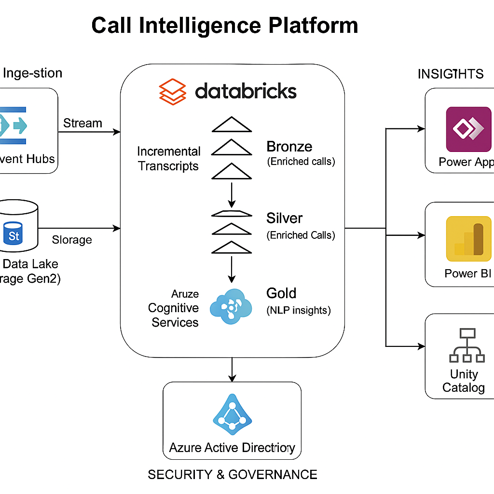

# 📞 Call Intelligence Platform

### 🚀 Scalable Call Center Transcript Analytics using Azure Databricks, Delta Lake, and Power Apps

---

## 🧠 Project Overview

**Call Intelligence Platform** is an end-to-end **data engineering and analytics solution** built on **Azure Databricks** and **Delta Lake**.  
It ingests **call center transcripts**, **enriches** them with CRM data, **extracts key phrases and sentiment** using **Azure Cognitive Services**, and finally exposes the insights through a **Power Apps** interface for human review and workflow management.

This project is designed and implemented as part of the **Databricks Certified Data Engineer Professional** certification preparation — demonstrating all the core competencies required by the exam through a practical enterprise-grade use case.

---

## 🏗️ Architecture Overview

### 🔹 High-Level Flow

1. **Ingest:** Transcripts streamed into **Azure Data Lake Storage Gen2**
2. **Enrich:** CRM details joined using **Databricks Delta Lake (Silver layer)**
3. **Analyze:** Key phrase extraction via **Azure Cognitive Services (NLP)**
4. **Store:** Results stored in **Delta Gold layer**
5. **Serve:** Insights consumed by **Power Apps** for reviewer assignment
6. **Secure:** Role-based access and governance via **Azure AD + Unity Catalog**

---

### 🧱 Architecture Diagram

_(replace this placeholder with your actual diagram in `/architecture/high_level_architecture.png`)_

---

## 🧩 Key Components

| Layer                       | Description                                              | Technology Stack                                 |
| --------------------------- | -------------------------------------------------------- | ------------------------------------------------ |
| **Ingestion (Bronze)**      | Incremental ingestion of transcripts using Auto Loader   | Azure Data Lake, Databricks Auto Loader          |
| **Transformation (Silver)** | Merge CRM data, schema evolution, data cleaning          | Delta Lake, PySpark                              |
| **Analytics (Gold)**        | NLP enrichment, key phrase extraction, sentiment scoring | Azure Cognitive Services, Databricks             |
| **Serving Layer**           | Data consumed by Power Apps & Power BI                   | Dataverse, Synapse Serverless, Power Platform    |
| **Security & Governance**   | AAD-based RBAC, Unity Catalog permissions                | Azure Active Directory, Databricks Unity Catalog |
| **Orchestration**           | Pipeline automation & job scheduling                     | Databricks Workflows / Azure Data Factory        |

---

## 🧠 Certification Alignment

This project covers all **Databricks Data Engineer Professional** exam domains:

| Certification Domain        | Implementation Example                             |
| --------------------------- | -------------------------------------------------- |
| Data Ingestion              | Auto Loader streaming pipelines                    |
| Transformation & Enrichment | Bronze → Silver → Gold Delta pipelines             |
| Performance Optimization    | Caching, ZORDER, partitioning, broadcast joins     |
| Data Governance             | Unity Catalog + AAD passthrough                    |
| Streaming                   | Incremental ingestion via Event Hub / Auto Loader  |
| Orchestration               | Databricks Jobs JSON workflow                      |
| Data Quality                | Schema validation, Delta constraints               |
| Deployment                  | Job clusters, Git integration, Power Apps frontend |

---

## 📁 Repository Structure

📦 call-intelligence-platform/
├── architecture/
│ ├── high_level_architecture.png
│ ├── data_flow_diagram.png
│ └── components_overview.md
├── notebooks/
│ ├── 01_ingestion_bronze_auto_loader.py
│ ├── 02_transformation_silver_enrichment.py
│ ├── 03_gold_keyphrase_extraction.py
│ ├── 04_data_quality_and_governance.py
│ └── 05_workflow_orchestration.py
├── config/
│ ├── connections.json
│ ├── secrets_template.json
│ └── schema_definitions/
├── datasets/
│ ├── sample_transcripts.json
│ ├── crm_customers.csv
│ └── key_phrases_config.json
├── pipelines/
│ └── databricks_job_workflow.json
├── docs/
│ ├── setup_databricks_cluster.md
│ ├── azure_ad_rbac_config.md
│ └── powerapps_integration_guide.md
├── tests/
│ ├── unit/
│ │ └── test_data_transformation.py
│ └── integration/
│ └── test_pipeline_end_to_end.py
└── README.md
